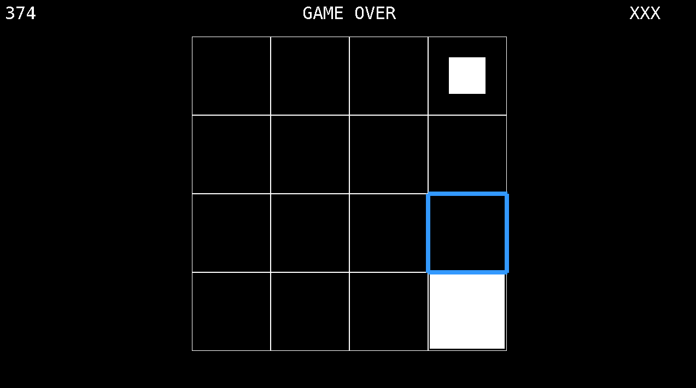

# shrinky
A shrinky game built with SDL2 and C++. 



## Prerequisites
Development was tested on Ubuntu22.04 with g++ 11.4.0 and SDL 2.0. Instructions for installing SDL2 and its related necessary dependencies can be found here. For debian users, `sudo apt-get install libsdl2-dev` should suffice, but you can refer to the [installation documentation](https://wiki.libsdl.org/SDL2/Installation#linuxunix) for official instructions.

## Setup and Installation 
```bash
git clone https://github.com/lanbas/shrinky.git
cd shrinky
make
```

## Controls
 * Move - `ARROWS`
 * Interact - `SPACE`

## Play 
```bash
./shrinky
```

Interact with the cell before it drains completely. Fill frequency and drain speed increase over time. Interactions with a cell that is unfilled results in a "strike", and so does the act of letting any cell drain completely. Three "strikes" and the game is over. 
